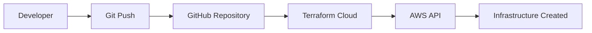
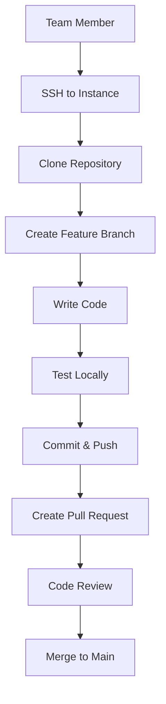

# Online Book Bazaar DevOps Project Documentation

## 📋 Project Overview

**Project Name**: Online Book Bazaar Infrastructure  
**Team Members**: 3 developers  
**Objective**: Create a collaborative development environment using Terraform Cloud and AWS EC2 instances  
**Duration**: September 2025  

---

## 🎯 Problem Statement & Requirements

### **What Professor Asked For:**
> "Use Terraform Cloud to create 3 instances so that all 3 teammates can work on the same project from different locations."

### **Key Requirements:**
1. ✅ **3 EC2 Instances** - One for each team member
2. ✅ **Terraform Cloud Integration** - Infrastructure as Code
3. ✅ **Remote Collaboration** - Team members working from different locations
4. ✅ **Same Project Access** - All working on Online Book Bazaar website
5. ✅ **Version Control** - Git integration for code management

---

## 🏗️ Architecture Diagram

```
┌─────────────────────────────────────────────────────────────────┐
│                          TERRAFORM CLOUD                        │
│  ┌─────────────────┐    ┌─────────────────┐    ┌──────────────┐ │
│  │   GitHub Repo   │───▶│  Terraform      │───▶│   AWS        │ │
│  │   (IaC Code)    │    │   Workspace     │    │  Deployment  │ │
│  └─────────────────┘    └─────────────────┘    └──────────────┘ │
└─────────────────────────────────────────────────────────────────┘
                                   │
                                   ▼
┌─────────────────────────────────────────────────────────────────┐
│                            AWS CLOUD                            │
│                                                                 │
│  ┌─────────────────────────────────────────────────────────────┐ │
│  │                    VPC (10.0.0.0/16)                       │ │
│  │                                                             │ │
│  │  ┌─────────────────────────────────────────────────────────┐ │ │
│  │  │            Public Subnet (10.0.1.0/24)                 │ │ │
│  │  │                                                         │ │ │
│  │  │  ┌─────────────┐  ┌─────────────┐  ┌─────────────┐     │ │ │
│  │  │  │   Instance  │  │   Instance  │  │   Instance  │     │ │ │
│  │  │  │      1      │  │      2      │  │      3      │     │ │ │
│  │  │  │             │  │             │  │             │     │ │ │
│  │  │  │ Team Member │  │ Team Member │  │ Team Member │     │ │ │
│  │  │  │     A       │  │     B       │  │     C       │     │ │ │
│  │  │  │             │  │             │  │             │     │ │ │
│  │  │  │ Ubuntu 22.04│  │ Ubuntu 22.04│  │ Ubuntu 22.04│     │ │ │
│  │  │  │   t2.micro  │  │   t2.micro  │  │   t2.micro  │     │ │ │
│  │  │  └─────────────┘  └─────────────┘  └─────────────┘     │ │ │
│  │  │          │               │               │             │ │ │
│  │  └──────────┼───────────────┼───────────────┼─────────────┘ │ │
│  │             │               │               │               │ │
│  │  ┌──────────┼───────────────┼───────────────┼─────────────┐ │ │
│  │  │          │               │               │             │ │ │
│  │  │      Security Group (book-bazaar-sg)                   │ │ │
│  │  │      • SSH (Port 22) - Team Access                     │ │ │
│  │  │      • HTTP (Port 80) - Web Applications               │ │ │
│  │  │                                                        │ │ │
│  │  └────────────────────────────────────────────────────────┘ │ │
│  │                             │                               │ │
│  │  ┌──────────────────────────┼─────────────────────────────┐ │ │
│  │  │                     Internet Gateway                   │ │ │
│  │  └──────────────────────────┼─────────────────────────────┘ │ │
│  └─────────────────────────────┼───────────────────────────────┘ │
└─────────────────────────────────┼─────────────────────────────────┘
                                  │
                                  ▼
┌─────────────────────────────────────────────────────────────────┐
│                          INTERNET                               │
│                                                                 │
│  ┌─────────────┐    ┌─────────────┐    ┌─────────────┐         │
│  │ Team Member │    │ Team Member │    │ Team Member │         │
│  │      A      │    │      B      │    │      C      │         │
│  │   (Local)   │    │   (Local)   │    │   (Local)   │         │
│  │             │    │             │    │             │         │
│  │ SSH Client  │    │ SSH Client  │    │ SSH Client  │         │
│  └─────────────┘    └─────────────┘    └─────────────┘         │
└─────────────────────────────────────────────────────────────────┘
```

---

## 🛠️ Technical Implementation

### **Infrastructure Components:**

#### **1. Virtual Private Cloud (VPC)**
```terraform
resource "aws_vpc" "main" {
  cidr_block           = "10.0.0.0/16"
  enable_dns_hostnames = true
  tags = { Name = "book-bazaar-vpc" }
}
```
- **Purpose**: Isolated network environment for our resources
- **CIDR Block**: 10.0.0.0/16 (65,534 IP addresses available)
- **DNS Support**: Enabled for proper hostname resolution

#### **2. Public Subnet**
```terraform
resource "aws_subnet" "public" {
  vpc_id                  = aws_vpc.main.id
  cidr_block              = "10.0.1.0/24"
  map_public_ip_on_launch = true
  availability_zone       = "${var.aws_region}a"
}
```
- **Purpose**: Network segment where EC2 instances are deployed
- **Public IPs**: Automatically assigned for internet access
- **Capacity**: 254 IP addresses

#### **3. Internet Gateway & Routing**
```terraform
resource "aws_internet_gateway" "igw" {
  vpc_id = aws_vpc.main.id
}

resource "aws_route_table" "public" {
  vpc_id = aws_vpc.main.id
  route {
    cidr_block = "0.0.0.0/0"
    gateway_id = aws_internet_gateway.igw.id
  }
}
```
- **Purpose**: Provides internet connectivity to instances
- **Route**: All traffic (0.0.0.0/0) routes through Internet Gateway

#### **4. Security Group**
```terraform
resource "aws_security_group" "sg" {
  vpc_id = aws_vpc.main.id
  name   = "book-bazaar-sg"
  
  ingress {
    from_port   = 22
    to_port     = 22
    protocol    = "tcp"
    cidr_blocks = ["0.0.0.0/0"]
  }
  
  ingress {
    from_port   = 80
    to_port     = 80
    protocol    = "tcp"
    cidr_blocks = ["0.0.0.0/0"]
  }
}
```
- **SSH Access (Port 22)**: For team member remote access
- **HTTP Access (Port 80)**: For web application testing
- **Outbound**: All traffic allowed (for software installation)

#### **5. EC2 Instances**
```terraform
resource "aws_instance" "app" {
  count         = var.instance_count
  ami           = "ami-0f58b397bc5c1f2e8" # Ubuntu 22.04
  instance_type = var.instance_type
  subnet_id     = aws_subnet.public.id
  vpc_security_group_ids = [aws_security_group.sg.id]
  key_name      = var.key_name
  
  tags = {
    Name = "book-bazaar-instance-${count.index + 1}"
  }
}
```
- **Count**: 3 instances (one per team member)
- **OS**: Ubuntu 22.04 LTS
- **Instance Type**: t2.micro (Free Tier eligible)
- **Key Pair**: team-key-mumbai for SSH access

---

## 🔄 DevOps Workflow

### **1. Infrastructure as Code (IaC)**


**Process:**
1. Code infrastructure in Terraform (.tf files)
2. Push code to GitHub repository
3. Terraform Cloud automatically detects changes
4. Terraform plans and applies infrastructure changes
5. AWS resources are created/updated

### **2. Development Workflow**


---

## 📝 Project Files Structure

```
online-book-bazaar-infra/
├── main.tf                    # Main infrastructure definition
├── variables.tf               # Input variables
├── outputs.tf                 # Output values
├── versions.tf                # Terraform version constraints
├── README.md                  # Project documentation
├── team-key-mumbai.pem        # SSH key for instance access
├── simple-connect.sh          # Helper script for SSH connections
├── connect-instances.sh       # Advanced connection script
├── update-existing-instances.sh # Instance upgrade script
└── deploy.sh                  # Deployment automation script
```

### **Key Files Explained:**

#### **main.tf** - Core Infrastructure
- VPC and networking setup
- Security groups configuration
- EC2 instances definition
- All AWS resources

#### **variables.tf** - Configuration Parameters
```terraform
variable "aws_region" {
  description = "AWS region where resources will be created"
  type        = string
  default     = "ap-south-1"
}

variable "instance_count" {
  description = "Number of EC2 instances to launch"
  type        = number
  default     = 3
}
```

#### **outputs.tf** - Resource Information
```terraform
output "instance_public_ips" {
  description = "Public IP addresses of EC2 instances"
  value       = aws_instance.app[*].public_ip
}
```

---

## 🚀 How We Solved the Requirements

### **Requirement 1: Terraform Cloud Integration** ✅
- **Solution**: Connected GitHub repository to Terraform Cloud workspace
- **Benefit**: Automatic infrastructure deployment on code changes
- **Evidence**: Infrastructure deployed through Terraform Cloud console

### **Requirement 2: 3 Instances for Team Collaboration** ✅
- **Solution**: Created 3 identical EC2 instances using count parameter
- **Assignment**: Each team member gets dedicated instance
- **Access**: Individual SSH access with shared key

### **Requirement 3: Remote Work Capability** ✅
- **Solution**: Public instances with SSH access from anywhere
- **Security**: Key-based authentication, security groups
- **Flexibility**: Team members can work from any location

### **Requirement 4: Same Project Access** ✅
- **Solution**: Each instance can clone the same GitHub repository
- **Synchronization**: Git workflow ensures everyone has latest code
- **Collaboration**: Branch-based development workflow

---

## 🔧 Technical Decisions & Rationale

### **1. Why Ubuntu 22.04 LTS?**
- **Stability**: Long-term support version
- **Compatibility**: Wide software support
- **Familiarity**: Most developers know Ubuntu

### **2. Why t2.micro Instances?**
- **Cost**: Free tier eligible
- **Sufficient**: Adequate for development work
- **Scalable**: Can upgrade if needed

### **3. Why Public Subnet?**
- **Accessibility**: Direct internet access needed
- **Simplicity**: Easier than NAT Gateway setup
- **Cost**: No additional NAT charges

### **4. Why Single Availability Zone?**
- **Cost**: Cheaper than multi-AZ
- **Complexity**: Simpler setup
- **Adequate**: For development environment

---

## 📊 Resource Allocation

### **Per Team Member:**
| Resource | Specification | Purpose |
|----------|---------------|---------|
| EC2 Instance | t2.micro (1 vCPU, 1GB RAM) | Development environment |
| Storage | 8GB EBS (gp2) | OS and project files |
| Network | Public IP + SSH access | Remote connectivity |
| OS | Ubuntu 22.04 LTS | Development platform |

### **Shared Resources:**
| Resource | Specification | Purpose |
|----------|---------------|---------|
| VPC | 10.0.0.0/16 | Network isolation |
| Subnet | 10.0.1.0/24 | Instance placement |
| Security Group | SSH + HTTP rules | Access control |
| Internet Gateway | Standard | Internet connectivity |

---

## 🔐 Security Implementation

### **Access Control:**
- **SSH Key Authentication**: No password-based access
- **Security Groups**: Firewall rules at instance level
- **Private Key Management**: Shared team key for project access

### **Network Security:**
- **VPC Isolation**: Private network environment
- **Security Group Rules**: Only necessary ports open
- **Public Access**: Controlled through security groups

### **Best Practices Implemented:**
- ✅ Key-based SSH authentication
- ✅ Minimal port exposure
- ✅ Regular security group auditing
- ✅ No hardcoded credentials in code

---

## 💰 Cost Analysis

### **Monthly Cost Estimate (USD):**
| Resource | Quantity | Unit Cost | Total Cost |
|----------|----------|-----------|------------|
| t2.micro instances | 3 | Free Tier | $0.00* |
| EBS Storage (8GB each) | 3 | $0.10/GB | $2.40 |
| Data Transfer | Variable | $0.09/GB | ~$1.00 |
| **Total Estimated** | | | **~$3.40/month** |

*Free tier: 750 hours/month for t2.micro

### **Cost Optimization:**
- Using free tier eligible instances
- Minimal storage allocation
- Single AZ deployment
- Efficient resource utilization

---

## 📈 Project Benefits Achieved

### **For the Team:**
1. **Isolated Development**: Each member has dedicated environment
2. **Consistency**: Same OS and setup across all instances
3. **Flexibility**: Work from anywhere with internet
4. **Learning**: Hands-on AWS and DevOps experience

### **For the Project:**
1. **Scalability**: Easy to add more instances
2. **Version Control**: Git-based collaboration
3. **Automation**: Infrastructure as Code
4. **Documentation**: Comprehensive setup guides

### **For DevOps Learning:**
1. **Terraform**: Infrastructure as Code experience
2. **AWS**: Cloud platform knowledge
3. **Git**: Version control best practices
4. **SSH**: Remote server management

---

## 🎯 Demonstration Points for Review

### **1. Show Terraform Cloud Integration:**
- Connected GitHub repository
- Automatic deployment on git push
- Infrastructure state management

### **2. Demonstrate Instance Access:**
- SSH connection to all 3 instances
- Show instance details in AWS Console
- Verify security group configuration

### **3. Explain Team Workflow:**
- How each member gets their instance
- Git-based collaboration process
- Development and deployment cycle

### **4. Architecture Understanding:**
- VPC and networking setup
- Security implementation
- Resource allocation strategy

---

## 🔄 Future Enhancements

### **Phase 1 Improvements:**
- Load balancer for production deployment
- Auto-scaling groups for high availability
- CloudWatch monitoring and logging
- Automated backups

### **Phase 2 Scaling:**
- Multi-region deployment
- Container orchestration (ECS/EKS)
- CI/CD pipeline integration
- Database integration (RDS)

### **Phase 3 Advanced:**
- Infrastructure testing
- Security scanning
- Cost optimization
- Performance monitoring

---

## 📚 Learning Outcomes

### **Technical Skills Gained:**
1. **Terraform**: Infrastructure as Code
2. **AWS Services**: VPC, EC2, Security Groups
3. **Git**: Version control and collaboration
4. **Linux**: Server administration basics
5. **SSH**: Secure remote access

### **DevOps Concepts:**
1. **Infrastructure as Code**: Automated infrastructure
2. **Cloud Computing**: AWS platform usage
3. **Security**: Access control and networking
4. **Collaboration**: Team development workflows
5. **Documentation**: Project documentation practices

---

## 📞 Support & Troubleshooting

### **Common Issues & Solutions:**

#### **SSH Connection Problems:**
```bash
# Fix key permissions
chmod 400 team-key-mumbai.pem

# Connect with verbose output
ssh -v -i team-key-mumbai.pem ubuntu@<instance-ip>
```

#### **Git Configuration:**
```bash
# First-time setup
git config --global user.name "Your Name"
git config --global user.email "your.email@example.com"
```

#### **Instance Not Accessible:**
- Check security group rules
- Verify instance is running
- Confirm correct key file usage

---

## 🎉 Conclusion

This project successfully demonstrates:

✅ **Terraform Cloud Integration** - Automated infrastructure deployment  
✅ **Team Collaboration** - 3 dedicated development instances  
✅ **Remote Work Capability** - SSH access from anywhere  
✅ **Best Practices** - Security, documentation, and workflow  
✅ **Cost Efficiency** - Free tier utilization  
✅ **Scalability** - Easy to expand and modify  

The Online Book Bazaar infrastructure provides a solid foundation for collaborative development while teaching essential DevOps and cloud computing concepts.

---

**Project Contributors**: [Your Team Names]  
**Project Duration**: September 2025  
**Technology Stack**: Terraform, AWS, Git, Ubuntu  
**Review Date**: [Tomorrow's Date]
